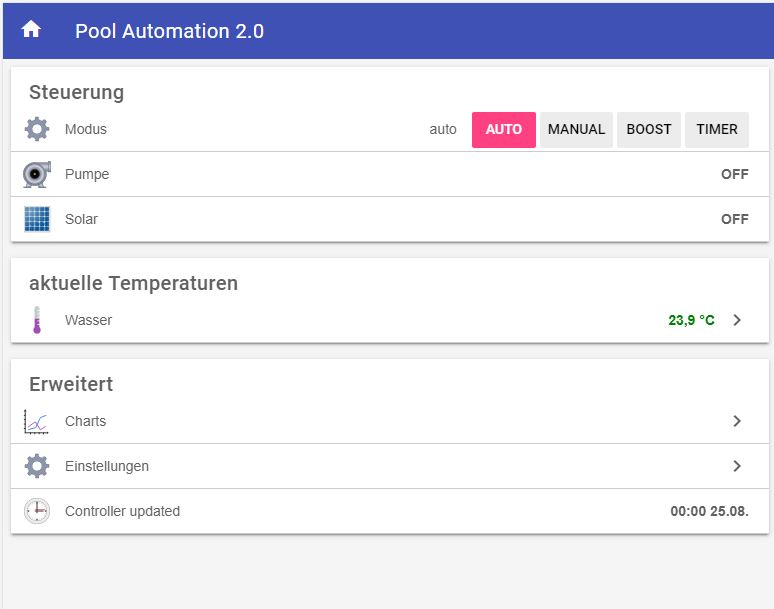
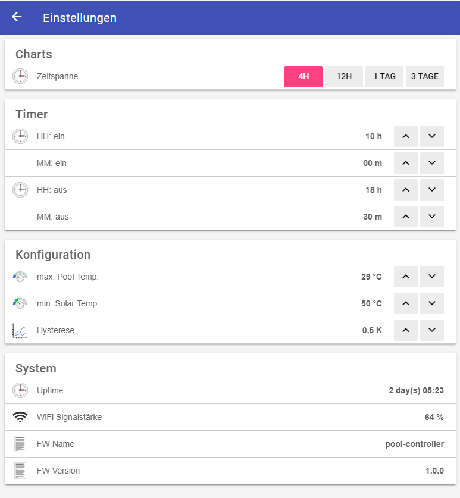
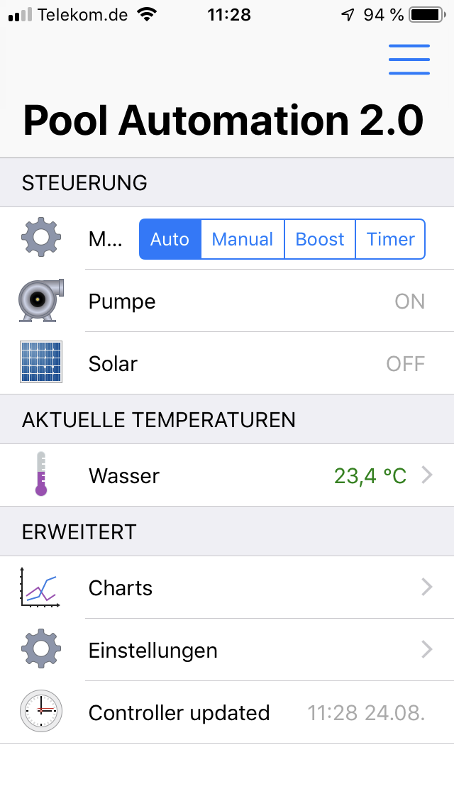
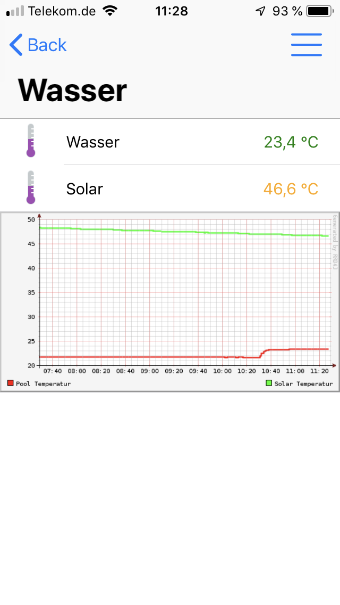
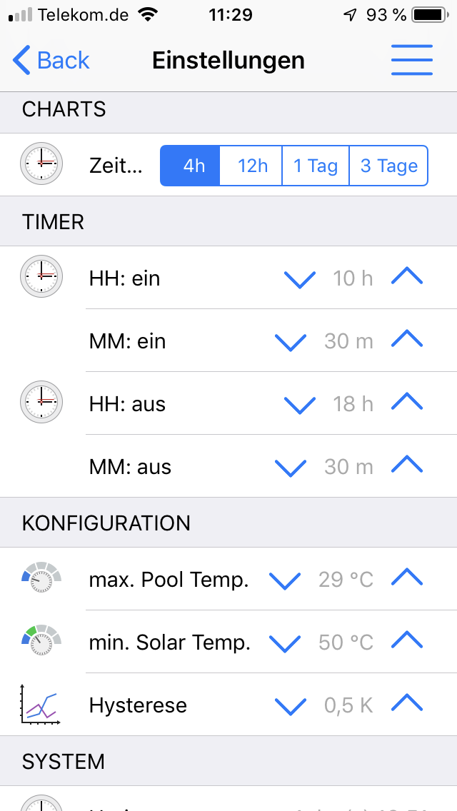
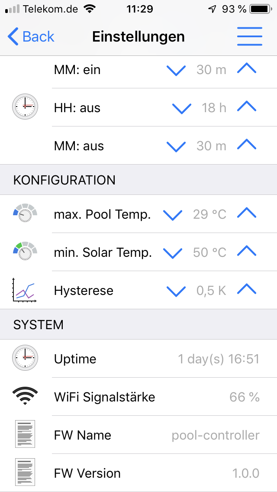

# openHAB Configuration | \ud83c\udfca Smart Swimming Pool

[](https://github.com/smart-swimmingpool)
[](https://opensource.org/licenses/MIT)
[](https://www.openhab.org/)

---

> **\u26a0\ufe0f Legacy notice**: [Home Assistant MQTT Discovery](https://www.home-assistant.io/integrations/mqtt/#mqtt-discovery) is now the **primary** integration path for the Pool Controller (v3.x). openHAB remains fully supported via MQTT but requires **manual configuration**.

---

## \u2728 Overview

This repository provides **openHAB configuration files** for integrating your Smart Swimming Pool system with [openHAB](https://www.openhab.org/), the open source home automation platform.

**What's included:**
- **Items** \u2014 Thing definitions and channel configurations
- **Rules** \u2014 Automation logic for pool control
- **Sitemaps** \u2014 User interface for mobile and web
- **Persistence** \u2014 Data storage configuration
- **Services** \u2014 MQTT broker and binding configuration
- **Transform** \u2014 Value transformations and mappings

---

## \u2728 Features

### \u2705 Supported Functionality

| Feature | Description | Status |
|---------|-------------|--------|
| **Switch Modes** | Auto, Manual, Boost, Timer operation modes | \u2705 Implemented |
| **Temperature Monitoring** | Pool water and solar collector temperatures | \u2705 Implemented |
| **Circulation Control** | Configurable cleaning circulation time | \u2705 Implemented |
| **Temperature Thresholds** | Max pool temp, min solar temp, hysteresis | \u2705 Implemented |
| **Alexa Integration** | Voice control via Alexa openHAB Add-on | \u2705 Implemented |
| **Mobile App** | iOS and Android app support | \u2705 Implemented |

### \u26a1 Compatibility Matrix

| Controller Version | Home Assistant | openHAB | Notes |
|-------------------|---------------|---------|-------|
| **2.x** | Limited support | \u2705 **Recommended** | Homie 3.0 MQTT |
| **3.x** | Native MQTT Discovery | \u2705 Manual MQTT | Requires manual configuration |

---

## \u26a1 Screenshots

### openHAB BasicUI

| Overview | Settings |
|----------|----------|
|  |  |

### Mobile App (openHAB iOS)

| Overview | Temperature |
|----------|-------------|
|  |  |

| Settings 1 | Settings 2 |
|------------|------------|
|  |  |

---

## \ud83d\ude80 Quick Start

### \u26a1 Prerequisites

| Component | Version | Notes |
|-----------|---------|-------|
| openHAB | 3.0+ | openHAB 3.x recommended |
| MQTT Binding | Latest | Required for MQTT integration |
| MQTT Broker | Any | Mosquitto, EMQX, or embedded openHAB broker |
| Pool Controller | v2.x or v3.x | Running and publishing MQTT data |

### \u26a1 Hardware Requirements

**Recommended hardware for openHAB server:**
- **Raspberry Pi 3/4/5** \u2014 Most common, good performance
- **Any x86_64 system** \u2014 Linux, Windows, or macOS
- **Docker container** \u2014 Official openHAB Docker image

**Minimum specifications:**
- 1GB RAM (2GB recommended)
- 8GB storage (16GB recommended for long-term use)
- Network connection to Pool Controller and MQTT broker

---

## \u26a1 Installation

### \u26a1 Option A: Raspberry Pi (Recommended)

#### 1. Install openHAB

**Method 1: openHABian (Recommended for beginners)**
```bash
# Download and run openHABian installer
curl -sS https://openhab.org/install | sudo bash /dev/stdin
```

**Method 2: Manual installation**
```bash
# Add openHAB repository
sudo apt-get update
sudo apt-get install -y openhab

# Start openHAB service
sudo systemctl start openhab
sudo systemctl enable openhab
```

#### 2. Install MQTT Broker (Mosquitto)

```bash
# Install Mosquitto
sudo apt-get update
sudo apt-get install -y mosquitto mosquitto-clients

# Start and enable Mosquitto
sudo systemctl start mosquitto
sudo systemctl enable mosquitto

# Test MQTT broker
mosquitto_sub -t "#" -v
```

#### 3. Install MQTT Binding in openHAB

1. Open openHAB **Main UI** at `http://<your-pi-ip>:8080`
2. Go to **Settings \u2192 Bindings**
3. Click **+ Add Binding**
4. Search for **MQTT Binding** and install it

---

### \u26a1 Option B: Docker

```bash
# Create docker-compose.yml
git clone https://github.com/smart-swimmingpool/openhab-config.git
cd openhab-config

# Start openHAB and Mosquitto
docker-compose up -d
```

**docker-compose.yml example:**
```yaml
version: '3'
services:
  openhab:
    image: openhab/openhab:3.4.0
    restart: unless-stopped
    volumes:
      - ./openhab-conf:/openhab/conf
      - ./openhab-userdata:/openhab/userdata
      - ./openhab-addons:/openhab/addons
    ports:
      - "8080:8080"
      - "8443:8443"
    environment:
      - USER_ID=1000
      - GROUP_ID=1000
      - TZ=Europe/Berlin

  mosquitto:
    image: eclipse-mosquitto:2.0
    restart: unless-stopped
    ports:
      - "1883:1883"
      - "9001:9001"
    volumes:
      - ./mosquitto-data:/mosquitto/data
      - ./mosquitto-log:/mosquitto/log
      - ./mosquitto-config:/mosquitto/config
```

---

## \u26a1 Configuration

### \u26a1 Step 1: Configure MQTT Broker

1. **Edit Mosquitto configuration** (if using external broker):
   ```bash
   sudo nano /etc/mosquitto/mosquitto.conf
   ```

2. **Add basic configuration:**
   ```ini
   # Listen on all interfaces
   listener 1883
   
   # Allow anonymous access (for testing)
   allow_anonymous true
   
   # Persistence
   persistence true
   persistence_location /var/lib/mosquitto/
   
   # Log file
   log_dest file /var/log/mosquitto/mosquitto.log
   ```

3. **Restart Mosquitto:**
   ```bash
   sudo systemctl restart mosquitto
   ```

### \u26a1 Step 2: Configure MQTT Binding in openHAB

1. **Add MQTT Broker Thing:**
   - Go to **Settings \u2192 Things**
   - Click **+ Add Thing**
   - Select **MQTT Binding**
   - Choose **MQTT Broker**
   - Configure:
     - **Broker Hostname:** `localhost` (or your broker IP)
     - **Port:** `1883`
     - **Client ID:** `openhab-smart-pool`
     - **Username/Password:** (if authentication is enabled)
   - Click **Save**

2. **Verify connection:**
   - Thing should show **ONLINE** status
   - Check openHAB logs for connection messages

### \u26a1 Step 3: Import Smart Swimming Pool Configuration

#### Method A: Manual File Copy

1. **Clone this repository:**
   ```bash
   git clone https://github.com/smart-swimmingpool/openhab-config.git
   ```

2. **Copy files to openHAB configuration:**
   ```bash
   # For openHAB 3.x
   cp -r openhab-config/items/* /etc/openhab/items/
   cp -r openhab-config/rules/* /etc/openhab/rules/
   cp -r openhab-config/sitemaps/* /etc/openhab/sitemaps/
   cp -r openhab-config/persistence/* /etc/openhab/persistence/
   cp -r openhab-config/services/* /etc/openhab/services/
   cp -r openhab-config/transform/* /etc/openhab/transform/
   ```

3. **Set permissions:**
   ```bash
   sudo chown -R openhab:openhab /etc/openhab/
   sudo chmod -R 755 /etc/openhab/
   ```

4. **Restart openHAB:**
   ```bash
   sudo systemctl restart openhab
   ```

#### Method B: Using openHAB UI (Recommended)

1. **Go to Settings \u2192 Things**
2. **Click + Add Thing**
3. **Select MQTT Binding**
4. **Add Generic MQTT Thing** for each Pool Controller topic

**Recommended Things to create:**

| Thing | Topic | Description |
|-------|-------|-------------|
| PoolController_Temperatures | `smart-swimmingpool/pool-controller/temperature/#` | Temperature sensors |
| PoolController_Pumps | `smart-swimmingpool/pool-controller/pump/#` | Pump controls |
| PoolController_Mode | `smart-swimmingpool/pool-controller/mode` | Operation mode |
| PoolController_State | `smart-swimmingpool/pool-controller/state` | Controller state |

---

## \ud83d\udcc1 File Structure

```text
openhab-config/
 items/                    # Item definitions
    pool-controller.items    # Pool Controller items
    pool-monitor.items      # Pool Monitor items (optional)
    
 rules/                    # Automation rules
    pool-automation.rules   # Main automation logic
    temperature-control.rules # Temperature-based control
    
 sitemaps/                 # User interface
    pool.sitemap           # Main sitemap
    pool-ui.sitemap        # Alternative UI
    
 persistence/              # Data storage
    rrd4j.persist          # Round Robin Database config
    
 services/                 # Service configurations
    mqtt.cfg               # MQTT binding configuration
    
 transform/                 # Value transformations
    mode.map              # Mode value mapping
    temperature.map        # Temperature unit conversion
```

---

## \ud83d\udcc1 Item Configuration

### Temperature Items

```java
// Pool Temperature
Number:Temperature Pool_Temperature "Pool Temperature [%.1f \u00b0C]" <temperature> 
  { channel="mqtt:topic:PoolController_Temperatures:pool-temp" }

// Solar Temperature
Number:Temperature Solar_Temperature "Solar Temperature [%.1f \u00b0C]" <temperature> 
  { channel="mqtt:topic:PoolController_Temperatures:solar-temp" }

// Temperature Difference
Number:Temperature Temp_Difference "Temp Difference [%.1f \u00b0C]" <temperature>
```

### Pump Control Items

```java
// Pool Pump Switch
Switch Pool_Pump "Pool Pump" <pump> 
  { channel="mqtt:topic:PoolController_Pumps:pool-pump" }

// Solar Pump Switch
Switch Solar_Pump "Solar Pump" <pump> 
  { channel="mqtt:topic:PoolController_Pumps:solar-pump" }

// Pump Runtime (Number:Time)
Number:Time Pool_Pump_Runtime "Pool Pump Runtime [%d h %02d min]" <time> 
  { channel="mqtt:topic:PoolController_Pumps:pool-pump-runtime" }
```

### Mode and Settings Items

```java
// Operation Mode
String Pool_Mode "Operation Mode [%s]" <settings> 
  { channel="mqtt:topic:PoolController_Mode:mode" }

// Max Pool Temperature
Number Pool_Max_Temp "Max Pool Temp [%.1f \u00b0C]" <temperature> 
  { channel="mqtt:topic:PoolController_Settings:max-pool-temp" }

// Min Solar Temperature
Number Solar_Min_Temp "Min Solar Temp [%.1f \u00b0C]" <temperature> 
  { channel="mqtt:topic:PoolController_Settings:min-solar-temp" }

// Hysteresis
Number Temp_Hysteresis "Temperature Hysteresis [%.1f \u00b0C]" <settings>
  { channel="mqtt:topic:PoolController_Settings:hysteresis" }
```

---

## \ud83d\udcc1 Sitemap Configuration

### Main Sitemap (sitemaps/pool.sitemap)

```java
sitemap pool label="Smart Swimming Pool" {
    Frame label="Overview" {
        Text item=Pool_Temperature
        Text item=Solar_Temperature
        Text item=Temp_Difference
        Text item=Pool_Mode
        
        Switch item=Pool_Pump
        Switch item=Solar_Pump
    }
    
    Frame label="Settings" {
        Setpoint item=Pool_Max_Temp minValue=10 maxValue=40 step=0.5
        Setpoint item=Solar_Min_Temp minValue=20 maxValue=80 step=0.5
        Setpoint item=Temp_Hysteresis minValue=0.5 maxValue=10 step=0.5
        
        Selection item=Pool_Mode mappings=["auto"="Auto", "manual"="Manual", "boost"="Boost", "timer"="Timer"]
    }
    
    Frame label="Statistics" {
        Text item=Pool_Pump_Runtime
        Text item=Solar_Pump_Runtime
        Text item=Pool_Controller_Uptime
    }
}
```

### Mobile-Optimized Sitemap

```java
sitemap pool-ui label="Pool UI" {
    Frame label="Quick Controls" {
        Switch item=Pool_Pump icon="pump"
        Switch item=Solar_Pump icon="sun"
        Text item=Pool_Temperature icon="temperature"
    }
    
    Frame label="Details" {
        Text item=Solar_Temperature
        Text item=Temp_Difference
        Text item=Pool_Mode
    }
}
```

---

## \ud83d\udcc1 Rule Configuration

### Temperature-Based Control (rules/temperature-control.rules)

```java
rule "Enable solar heating when beneficial"
when
    Item Solar_Temperature changed or
    Item Pool_Temperature changed
then
    val solarTemp = Solar_Temperature.state as Number
    val poolTemp = Pool_Temperature.state as Number
    val minSolarTemp = Solar_Min_Temp.state as Number
    val maxPoolTemp = Pool_Max_Temp.state as Number
    val hysteresis = Temp_Hysteresis.state as Number
    
    if (solarTemp != null && poolTemp != null && 
        solarTemp > minSolarTemp && 
        poolTemp < maxPoolTemp &&
        (solarTemp - poolTemp) > hysteresis) {
        Solar_Pump.sendCommand(ON)
    } else {
        Solar_Pump.sendCommand(OFF)
    }
end
```

### Circulation Pump Control

```java
rule "Run circulation pump on schedule"
when
    Time cron "0 0 6,18 * * ?"  // 6:00 AM and 6:00 PM
then
    if (Pool_Mode.state == "auto") {
        Pool_Pump.sendCommand(ON)
        
        // Turn off after 2 hours
        createTimer(now.plusHours(2)) [|
            Pool_Pump.sendCommand(OFF)
        ]
    }
end
```

### Mode-Based Control

```java
rule "Handle mode changes"
when
    Item Pool_Mode changed
then
    switch (Pool_Mode.state) {
        case "manual": 
            // In manual mode, don't auto-control pumps
            logInfo("Pool", "Manual mode activated - manual control only")
        case "auto": 
            // Re-evaluate automation
            logInfo("Pool", "Auto mode activated - automation enabled")
            // Trigger temperature control
            postUpdate(Solar_Temperature)
        case "boost": 
            // Run both pumps continuously
            Pool_Pump.sendCommand(ON)
            Solar_Pump.sendCommand(ON)
            logInfo("Pool", "Boost mode activated - all pumps ON")
        case "timer": 
            // Timer mode handled by separate rule
            logInfo("Pool", "Timer mode activated")
    }
end
```

---

## \ud83d\udcc1 MQTT Topic Configuration

### For Pool Controller v3.x (Home Assistant Discovery)

The Pool Controller v3.x uses **Home Assistant MQTT Discovery** by default. To use with openHAB, you need to configure the MQTT binding to subscribe to the discovery topics or the state topics directly.

**Home Assistant Discovery Topics:**
```text
homeassistant/sensor/pool-controller/pool-temp/state
homeassistant/sensor/pool-controller/solar-temp/state
homeassistant/switch/pool-controller/pool-pump/state
homeassistant/switch/pool-controller/solar-pump/state
homeassistant/select/pool-controller/mode/state
homeassistant/number/pool-controller/pool-target-temp/state
homeassistant/number/pool-controller/solar-min-delta/state
```

### For Pool Controller v2.x (Homie 3.0)

**Homie 3.0 Topics:**
```text
homie/pool-controller/$homie
homie/pool-controller/$name
homie/pool-controller/$state
homie/pool-controller/$nodes

homie/pool-controller/temperature/$type
homie/pool-controller/temperature/$properties

homie/pool-controller/pump/$type
homie/pool-controller/pump/$properties
```

### Legacy Topics (Pre-v3.0)

```text
smart-swimmingpool/pool-controller/state
smart-swimmingpool/pool-controller/temperature/pool
smart-swimmingpool/pool-controller/temperature/solar
smart-swimmingpool/pool-controller/pump/pool/state
smart-swimmingpool/pool-controller/pump/solar/state
smart-swimmingpool/pool-controller/mode
```

**Complete Reference:** [Pool Controller MQTT Configuration](https://github.com/smart-swimmingpool/pool-controller/blob/main/docs/mqtt-configuration.md)

---

## \u26a1 Persistence Configuration

### RRD4J Configuration (persistence/rrd4j.persist)

```java
// Temperature data - keep for 1 year with 5 minute resolution
Number:Temperature Pool_Temperature : strategy = everyChange, restoreOnStartup
Number:Temperature Solar_Temperature : strategy = everyChange, restoreOnStartup

// Pump runtime - keep for 1 year with hourly resolution
Number:Time Pool_Pump_Runtime : strategy = everyHour, restoreOnStartup
Number:Time Solar_Pump_Runtime : strategy = everyHour, restoreOnStartup

// State data - keep for 30 days with every change
Switch Pool_Pump : strategy = everyChange, restoreOnStartup
Switch Solar_Pump : strategy = everyChange, restoreOnStartup
String Pool_Mode : strategy = everyChange, restoreOnStartup
```

---

## \u26a1 Alexa Integration

### Prerequisites

1. **Install openHAB Alexa Skill**
   - In openHAB: **Settings \u2192 Voice Assistants \u2192 Alexa**
   - Click **Enable Alexa Skill**
   - Follow the authentication flow

2. **Configure Alexa App**
   - Open Alexa app on your phone
   - Go to **Skills & Games**
   - Find and enable **openHAB** skill
   - Link your openHAB account

### Item Tagging for Alexa

Add tags to items for Alexa discovery:

```java
// Pool Pump with Alexa support
Switch Pool_Pump "Pool Pump" <pump> 
  { channel="mqtt:topic:PoolController_Pumps:pool-pump", alexa="PowerController.powerState" }

// Solar Pump with Alexa support
Switch Solar_Pump "Solar Pump" <pump> 
  { channel="mqtt:topic:PoolController_Pumps:solar-pump", alexa="PowerController.powerState" }

// Temperature sensors (read-only)
Number:Temperature Pool_Temperature "Pool Temperature [%.1f \u00b0C]" <temperature> 
  { channel="mqtt:topic:PoolController_Temperatures:pool-temp", alexa="TemperatureSensor.temperature" }
```

### Alexa Voice Commands

| Command | Action |
|---------|--------|
| "Alexa, turn on pool pump" | Turns on pool circulation pump |
| "Alexa, turn off solar pump" | Turns off solar heating pump |
| "Alexa, what's the pool temperature?" | Reports current pool temperature |
| "Alexa, what's the solar temperature?" | Reports current solar collector temperature |
| "Alexa, set pool mode to auto" | Changes operation mode to Auto |

---

## \u26a1 Mobile App Configuration

### openHAB iOS/Android App

1. **Install the app:**
   - [iOS App Store](https://apps.apple.com/app/openhab/id492054521)
   - [Android Play Store](https://play.google.com/store/apps/details?id=org.openhab.habdroid)

2. **Connect to your openHAB server:**
   - Open app and tap **+ Add Connection**
   - Enter your server details:
     - **URL:** `http://<your-pi-ip>:8080` or `https://<your-domain>.com`
     - **Username/Password:** (if authentication is enabled)
   - Tap **Save**

3. **Customize the UI:**
   - Long-press on any widget to edit
   - Add new widgets from the **+ Add Widget** menu
   - Rearrange widgets by dragging

---

## \u26a1 Troubleshooting

### Common Issues

| Issue | Possible Cause | Solution |
|-------|---------------|----------|
| Items show NULL | MQTT not connected | Check MQTT broker connection, verify topic names |
| Items not updating | Wrong MQTT topic | Verify topic configuration in items |
| openHAB not starting | Configuration error | Check logs: `sudo tail -f /var/log/openhab/openhab.log` |
| MQTT binding not available | Not installed | Install via Main UI or Karaf console |
| Alexa not discovering devices | Skill not linked | Re-link Alexa skill, check item tags |
| Mobile app can't connect | Network issue | Verify server URL, check firewall |

### Debugging Steps

1. **Check openHAB logs:**
   ```bash
   sudo tail -f /var/log/openhab/openhab.log
   ```

2. **Check MQTT broker logs:**
   ```bash
   sudo tail -f /var/log/mosquitto/mosquitto.log
   ```

3. **Test MQTT topics:**
   ```bash
   # Subscribe to all topics
   mosquitto_sub -t "#" -v
   
   # Publish test message
   mosquitto_pub -t "test/topic" -m "hello"
   ```

4. **Verify item configuration:**
   - Go to **Developer Tools \u2192 Items** in openHAB UI
   - Check item states and configurations

5. **Test rules:**
   - Go to **Developer Tools \u2192 Rules**
   - Manually trigger rules to test logic

---

## \u26a1 Best Practices

### Configuration

1. **Use meaningful item names** \u2014 Easy to identify and manage
2. **Add metadata to items** \u2014 Tags, labels, descriptions
3. **Group related items** \u2014 Use groups for organization
4. **Use semantic modeling** \u2014 Things, Locations, Equipment
5. **Document your configuration** \u2014 Comments in files, README

### Performance

1. **Limit persistence frequency** \u2014 Don't store every change for high-frequency data
2. **Use appropriate strategies** \u2014 everyChange, everyUpdate, everyMinute, etc.
3. **Avoid complex rules** \u2014 Break into smaller, simpler rules
4. **Use timers wisely** \u2014 Clean up timers when no longer needed
5. **Monitor system resources** \u2014 Check memory and CPU usage

### Security

1. **Enable authentication** \u2014 For both openHAB and MQTT broker
2. **Use TLS/SSL** \u2014 Encrypt MQTT traffic in production
3. **Restrict network access** \u2014 Firewall rules for openHAB ports
4. **Keep software updated** \u2014 Regularly update openHAB and plugins
5. **Backup configuration** \u2014 Regular backups of /etc/openhab/

---

## \ud83e\udd1d Contributing

We welcome contributions! Please follow these steps:

1. **Fork the repository**
2. **Create a feature branch** (e.g., `feat/add-alexa-support`)
3. **Make your changes**
4. **Test thoroughly** in your openHAB environment
5. **Update documentation** if applicable
6. **Submit a pull request**

### Quality Checks

- \u2705 Test configuration in openHAB before submitting
- \u2705 Verify all items and rules work correctly
- \u2705 Check for typos and formatting issues
- \u2705 Ensure compatibility with openHAB 3.x

---

## \ud83d\udcdc License

[MIT License](LICENSE) \u2013 Free to use, modify, and share.

---

## \ud83c\udf10 Community & Support

- **Discussions:** [GitHub Discussions](https://github.com/smart-swimmingpool/smart-swimmingpool.github.io/discussions)
- **Website:** [smart-swimmingpool.com](https://smart-swimmingpool.com)
- **openHAB Community:** [community.openhab.org](https://community.openhab.org/)

**Need Help?**
1. Check this README for common issues
2. Search [GitHub Discussions](https://github.com/smart-swimmingpool/smart-swimmingpool.github.io/discussions)
3. Open a [new issue](https://github.com/smart-swimmingpool/openhab-config/issues/new)

---

## \ud83d\udce2 Related Projects

| Project | Description |
|---------|-------------|
| [Pool Controller](https://github.com/smart-swimmingpool/pool-controller) | Main control unit with MQTT integration |
| [Pool Monitor](https://github.com/smart-swimmingpool/monitor) | Solar-powered wireless temperature display |
| [Grafana Dashboard](https://github.com/smart-swimmingpool/grafana-dashboard) | Visualization dashboard |
| [Water Quality Monitor](https://github.com/smart-swimmingpool/water-quality-monitor) | Water quality monitoring (pH, chlorine) |
| [Website](https://github.com/smart-swimmingpool/website) | Project documentation website |

---

## \ud83d\udcbb Additional Resources

### openHAB
- [openHAB Documentation](https://www.openhab.org/docs/) \u2014 Official documentation
- [openHAB Community Forum](https://community.openhab.org/) \u2014 Community support
- [openHAB Tutorials](https://www.openhab.org/docs/tutorial/) \u2014 Learning resources
- [openHAB Add-ons](https://www.openhab.org/addons/) \u2014 Available bindings and UIs

### MQTT
- [MQTT Protocol](https://mqtt.org/) \u2014 MQTT specification
- [Mosquitto](https://mosquitto.org/) \u2014 Popular MQTT broker
- [MQTT Explorer](http://mqtt-explorer.com/) \u2014 MQTT client for testing

### Smart Home
- [Home Assistant](https://www.home-assistant.io/) \u2014 Alternative home automation
- [Home Assistant MQTT Discovery](https://www.home-assistant.io/integrations/mqtt/#mqtt-discovery) \u2014 Auto-discovery documentation

### Raspberry Pi
- [Raspberry Pi Documentation](https://www.raspberrypi.org/documentation/) \u2014 Official docs
- [Raspberry Pi OS](https://www.raspberrypi.org/software/) \u2014 Operating system

---

<p align="center">
  Made with \u2764\ufe0f by the Smart Swimming Pool community
</p>
