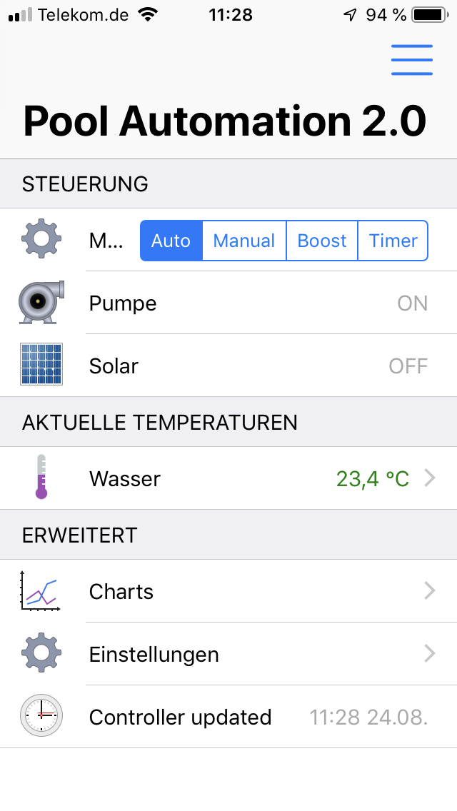
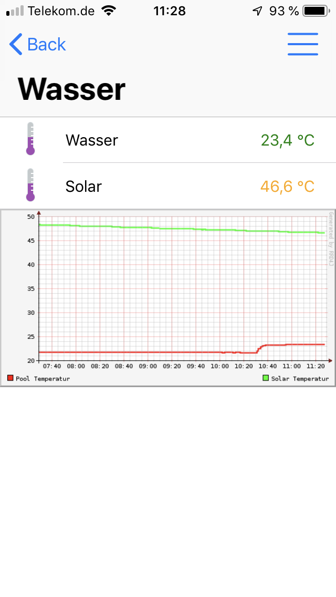
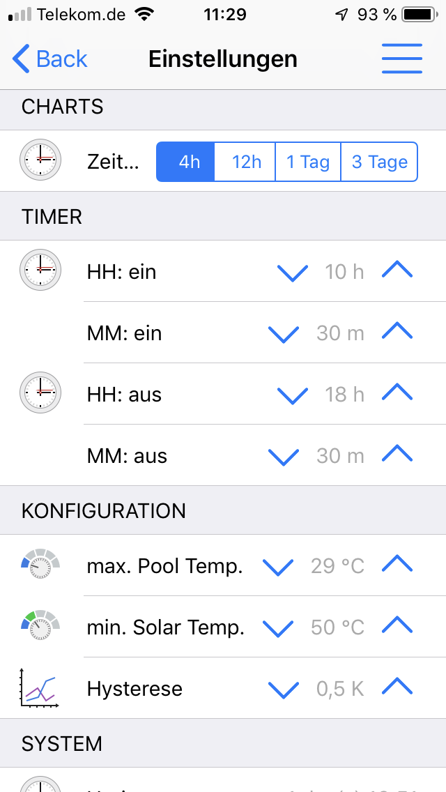

# OpenHAB Configuration | 🏊 Smart Swimmingpool 

**🏊 The Homie 3.0 compatible Smart Swimmingpool Controller 🎛️**

Configuration example to use the Smart Swimming Pool system on openHAB

Configuration sources: [https://github.com/smart-swimmingpool/openhab-config](https://github.com/smart-swimmingpool/openhab-config)

# Mobile App (openHAB iOS)

| Overview |  Temperature Chart |
: ---------:--------------------:
|  |  |

| Settings | Settings |
:----------:----------:
|  |  |


# Precondition

The Smart Swimming Pool project uses Homie 3.0 based MQTT messaging. Therfor you have to install 
an MQTT broker in your environment.

## Raspberry Pi

I use an Raspberry Pi (Model 3) ([Amazon](https://amzn.to/2NnqwDQ)). The latest version of openHAB has an embedded MQTT broker. In this example a seperate broker [Mosquitto](https://mosquitto.org/) on same Raspberry Pi is configured.

## Install Mosquitto

- Install Mosquitto on Raspberry Pi:
  ``` 
  sudo apt-get update
  sudo apt-get upgrade
  sudo apt-get install mosquitto
  ```
- In Paper UI install add-on 'MQTT Binding' from bindings.
- Check `services/mqtt.cfg` for your environment.
