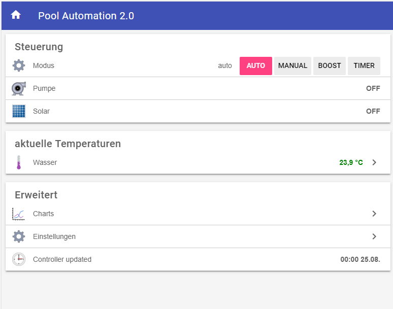
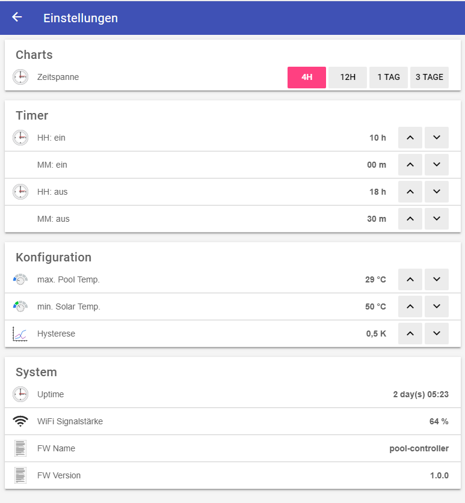

# OpenHAB Configuration | 🏊 Smart Swimmingpool 

Configuration example to use the [Smart Swimming Pool system](https://smart-swimmingpool.github.io/) on openHAB.

Configuration sources: [https://github.com/smart-swimmingpool/openhab-config](https://github.com/smart-swimmingpool/openhab-config)

## Features

- [x] Switch Modes: Auto, Manual, Boost, Timer
- [x] Monitor current temparature of pool water and solar heating
- [x] Configuration of
    - start and end time of cleaning circulation time
    - max. temparature of pool water
    - min temparature of solar heating 
    - hystesis
- [x] Compatible with Alexa openHAB Add-on

## OpenHAB BasicUI Sitemap

| openHAB Pool Automation: Overview            | openHAB Pool Automation: Settings         |
|----------------------------------------------|----------------------------------------------|
|   |  |

## Mobile App (openHAB iOS)

This configuration running on openHAB iOS App:

| openHAB Pool Automation: Overview            | openHAB Pool Automation: Temparature         |
|----------------------------------------------|----------------------------------------------|
|   |  |


| openHAB Pool Automation: Settings            | openHAB Pool Automation: Settings            |
|----------------------------------------------|----------------------------------------------|
|  |  |


## Precondition

The Smart Swimming Pool project uses Homie 3.0 based MQTT messaging. Therfor you have to install 
an MQTT broker in your environment.

### Raspberry Pi

I use an Raspberry Pi (Model 3) ([Amazon](https://amzn.to/2NnqwDQ)). The latest version of openHAB has an embedded MQTT broker. In this example a seperate broker [Mosquitto](https://mosquitto.org/) on same Raspberry Pi is configured.

### Install Mosquitto

- Install Mosquitto on Raspberry Pi:
  ``` 
  sudo apt-get update
  sudo apt-get upgrade
  sudo apt-get install mosquitto
  ```
- In Paper UI install add-on 'MQTT Binding' from bindings.
- Check `services/mqtt.cfg` for your environment.
