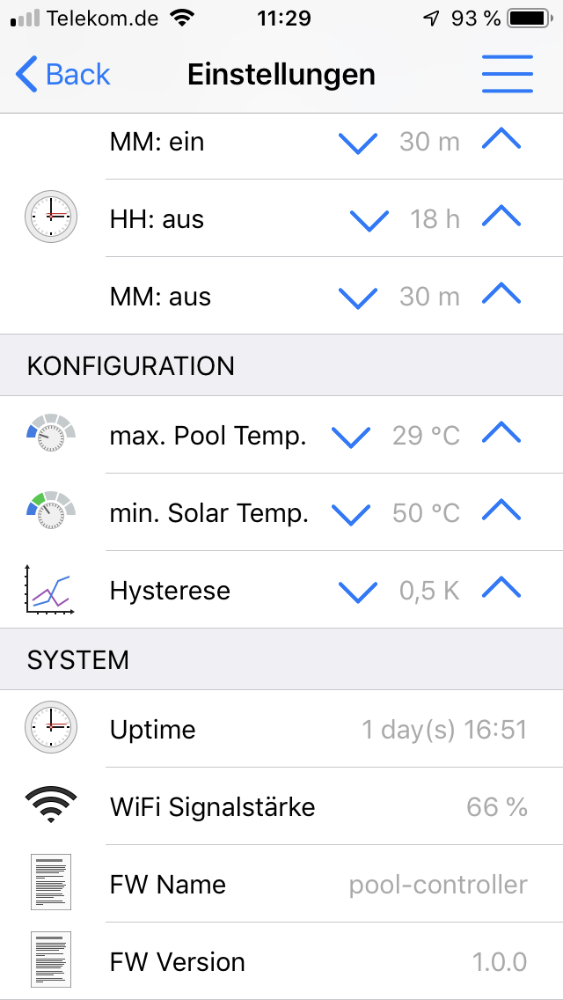

# OpenHAB Configuration | 🏊 Smart Swimmingpool 

**🏊 The Homie 3.0 compatible Smart Swimmingpool Controller 🎛️**

Configuration example to use the Smart Swimming Pool system on openHAB

# Mobile App (openHAB iOS)

| Overview |  Temperature Chart |
: ---------:--------------------:
|  |  |

| Settings | Settings |
:----------:----------:
|  |  |

Configuration sources: https://github.com/smart-swimmingpool/openhab-config

## Hardware

- Raspberry Pi 3 Modell B+ ([Amazon](https://amzn.to/2NnqwDQ))
